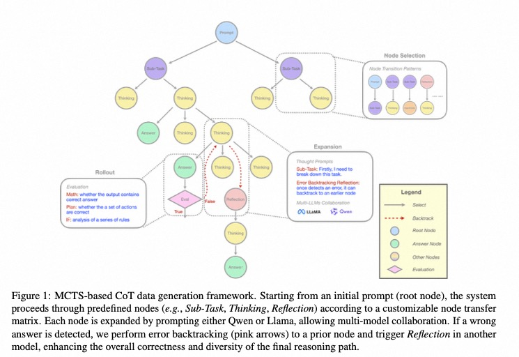
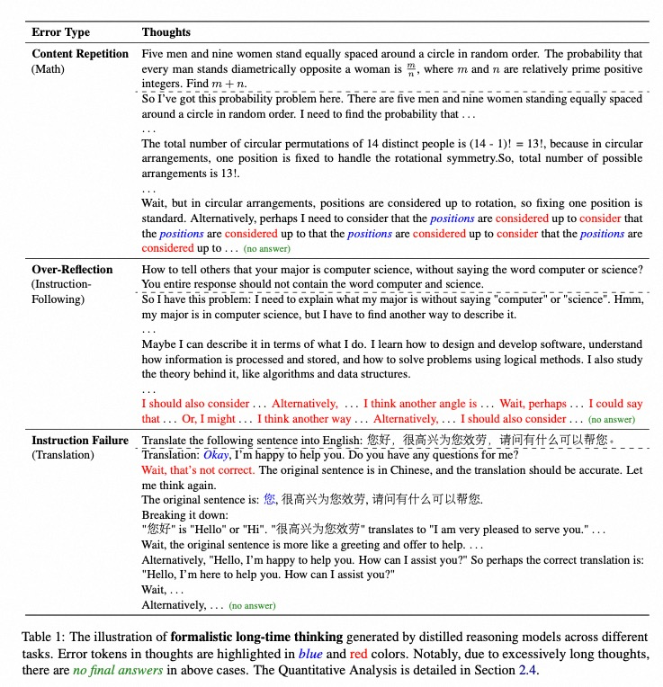

<p align="center">
    
<p>

# 🍓 Marco-o1: Towards Efficient Reasoning Models

<!-- Broader Real-World Applications -->

<!-- # 🍓 Marco-o1: An Open Large Reasoning Model for Real-World Solutions -->

<!-- <h2 align="center"> <a href="https://github.com/AIDC-AI/Marco-o1/">Marco-o1</a></h2> -->
<!-- <h5 align="center"> If you appreciate our project, please consider giving us a star ⭐ on GitHub to stay updated with the latest developments.  </h2> -->
 
<h4 align="center">

<!-- [](https://huggingface.co/) [](https://github.com/AIDC-AI/Marco-o1/) -->


<div align="center">
 


</h4>

<div align="center">

<!-- **Affiliations:** -->

<!-- ⭐ _**MarcoPolo Team**_ ⭐ -->

⭐[_**Alibaba International Digital Commerce**_](https://aidc-ai.com)⭐

:octocat: [**Github**](https://github.com/AIDC-AI/Marco-o1)  🤗  [**Hugging Face**](https://huggingface.co/AIDC-AI/Marco-o1) 📝  [**Paper**](https://arxiv.org/abs/2411.14405) 🧑‍💻 [**Model**](https://huggingface.co/AIDC-AI/Marco-o1) 🗂️  [**Data**](https://github.com/AIDC-AI/Marco-o1/tree/main/data) 📽️  [**Demo**](https://huggingface.co/AIDC-AI/Marco-o1)

</div>

#

🎯 **Marco-o1** not only focuses on subjects with standard answers, such as mathematics, physics, and coding that are highly suitable for the use of Reinforcement Learning, but we also emphasize some open-ended solutions. Our goal is to build a general model applicable to agentic, incorporating comprehensive planning capabilities and function call abilities.

⚠️ **Limitations:** <ins>We would like to emphasize that this research work is inspired by OpenAI's o1 (from which the name is also derived). 
This work aims to explore potential approaches to shed light on the currently unclear technical roadmap for large reasoning models. 
Besides, our focus is on open-ended questions, and we have observed interesting phenomena in multilingual applications. 
However, we must acknowledge that the current model primarily exhibits o1-like reasoning characteristics and its performance still fall short of a fully realized "o1" model. 
This is not a one-time effort, and we remain committed to continuous optimization and ongoing improvement.</ins>

<div align="center">
</div>

<div align="center">
  
  <p><strong>Figure 1: </strong> A classic 'strawberry' question reasoned by our Marco-o1 model: "How many 'r' are in strawberry". Although the answer is correct, the final letter 'y' is overlooked during CoT. This is an interesting finding, which is discussed in issue https://github.com/AIDC-AI/Marco-o1/issues/3.</p>
</div>

<div align="center">
  
  <p><strong>Figure 1: </strong> A classic 'strawberry' question reasoned by our Marco-o1 model: "How many 'r' are in strawberry". Although the answer is correct, the final letter 'y' is overlooked during CoT. This is an interesting finding, which is discussed in issue https://github.com/AIDC-AI/Marco-o1/issues/3.</p>
</div>


## 🔥 News

<!-- ## Coming Soon -->

<!-- This is our initial version, and we will continue to update and enhance the model's reasoning capabilities. -->

- [Coming Soon] 🏃 **Marco-o1 Agentic:** A more powerful agentic model is coming soon...

- [2025/02/09] 🔥 **[EDPO(Difficulty-Estimated Policy Optimization)](https://arxiv.org/abs/2602.06375):** We proposed an optimization algorithm based on an online data difficulty selector. To our knowledge, this is the first work on online data selection. Experiments show that compared with GRPO, we can better resist the noise interference caused by Zero Advantage, achieving an average performance improvement of 2.4%. At the same time, this online selector can also provide multi-scale routing based on prompt difficulty in large-scale online services.

- [2025/02/09] 🔥 Our paper **[A State-Transition Framework for Efficient LLM Reasoning](https://arxiv.org/abs/2602.01198)** has been accepted to the main conference of ICLR 2026.

- [2025/02/09] 🔥 **Marco-o1 Efficiency:** We released **[Marco-o1 Efficiency](./README_v3.md)**. By training a pluggable Linear component MAM (Mixed Attention Module) on the existing Dense model, we were able to dynamically compress the model to save context tokens. At the same time, we introduced TTT (Test-Time Training), and ultimately we achieved a 20% reduction in inference cost while obtaining an average performance improvement of 4.7%.

- [2025/05/15] 🔥 Our paper **[《Marco-o1 v2: Towards Widening The Distillation Bottleneck for Reasoning Models》](https://arxiv.org/abs/2503.01461)** has been accepted to the main conference of ACL 2025.


- [2025/02/14] 🔥 We released **[Marco-o1 v2](./README_v2.md)**. This version entirely relies on self-built data and has undergone DPO. It has been optimized more comprehensively for mathematical problem-solving、planning and instruction-following capabilities. 🍬 This time, our model's ability in counting letters is quite impressive! 😁


- [2024/11/13] 🔥 We released **[Marco-o1 v1](./README_v1.md)**: Towards Open Reasoning Models for Open-Ended Solutions. This initial release includes our reasoning model, optimized for complex problem-solving and versatile applications across various domains.


## 🔔 Introduction

### Marco-o1 v1

OpenAI recently introduced the groundbreaking o1 model, renowned for its exceptional reasoning capabilities. This model has demonstrated outstanding performance on platforms such as AIME and CodeForces, surpassing other leading models. Inspired by this success, we aimed to push the boundaries of LLMs even further, enhancing their reasoning abilities to tackle complex, real-world challenges.

🌍 Marco-o1 leverages advanced techniques like CoT fine-tuning, MCTS, and Reasoning Action Strategies to enhance its reasoning power. As shown in Figure 2, by fine-tuning Qwen2-7B-Instruct with a combination of the filtered Open-O1 CoT dataset, Marco-o1 CoT dataset, and Marco-o1 Instruction dataset, Marco-o1 improved its handling of complex tasks. MCTS allows exploration of multiple reasoning paths using confidence scores derived from softmax-applied log probabilities of the top-k alternative tokens, guiding the model to optimal solutions. Moreover, our reasoning action strategy involves varying the granularity of actions within steps and mini-steps to optimize search efficiency and accuracy.

<div align="center">
  
  <p><strong>Figure 2: </strong>The overview of Marco-o1.</p>
</div>

🌏 As shown in Figure 3, Marco-o1 achieved accuracy improvements of +6.17% on the MGSM (English) dataset and +5.60% on the MGSM (Chinese) dataset, showcasing enhanced reasoning capabilities. 

<div align="center">
  
  <p><strong>Figure 3: </strong>The main results of Marco-o1.</p>
</div>

🌎 Additionally, in translation tasks, we demonstrate that Marco-o1 excels in translating slang expressions, such as translating "这个鞋拥有踩屎感" (literal translation: "This shoe offers a stepping-on-poop sensation.") to "This shoe has a comfortable sole," demonstrating its superior grasp of colloquial nuances.

<div align="center">
  
  <p><strong>Figure 4: </strong>The demonstration of translation task using Marco-o1.</p>
</div>

<!-- ## 🎨 Case Show

This is a classic example from our Marco-o1 model, "How many 'r's are in the word 'strawberry'?" Through multiple search steps, the correct answer was obtained, as shown in Figure 2. Although we tested general reasoning capabilities, our primary focus is on tackling challenging translation problems. An example of this focus is shown in Figure 3, illustrating the translation of the sentence "This shoe has a comfortable sole and is highly recommended for purchase."
 -->
<!-- <div align="center">
  
  <p><strong>Figure 2: </strong>Reasoning example of "How many 'r' are in strawberry"</p>
</div> -->


For more detail please refer to [this](./README_v1.md) or our [paper](https://arxiv.org/abs/2411.14405).

### Marco-o1 v2

For Marco-o1 v2, we have removed some data from Open-O1 and replaced it entirely with Marco-o1 CoT data. We have expanded both the categories and quantity of our CoT data, 
Additionally, we improved our MCTS architecture to enable dynamic addition of reflections, as shown in Figure 5. 
While also conducting DPO using naturally data pairs from MCTS.

<div align="center">
  
  <p><strong>Figure 5: </strong>In Marco-o1 v2, we restructured the MCTS architecture.</p>
</div>

As mentioned in our [paper](https://arxiv.org/abs/2503.01461), we found that models like R1 and QwQ often engage in reflection for the sake of reflection itself, which we called **formalistic long-time thinking**. This has a certain impact on the distillation learning of smaller models, leading to behaviors such as repetitive generate and redundant thinking.

<div align="center">
  
  <p><strong>Figure 6: </strong>Example for formalistic long-time thinking</p>
</div>

Data constructed using MCTS is more suitable for smaller models, as it does not involve redundant thinking and reflection. Instead, we start with planning at the very beginning of the CoT process and then gradually work through the problem. We only guide the model to reflect at appropriate moments. This aligns better with the capabilities and thinking patterns of lower-capacity smaller models.

Additionally, we have conducted DPO using naturally formed positive and negative pairs from MCTS and have made some preliminary findings.

We have open-sourced our MCTS search code.
For more detail please refer to [this](./README_v2.md) or our [paper](https://arxiv.org/abs/2503.01461
).

### Marco-o1 ???

We are now working on expanding the Marco-o1 family. These expansions include a more robust model based on RL, tailored for agent scenarios. This model places greater emphasis on the accuracy of function call and planning abilities, which are crucial for current agent applications.

Additionally, as mentioned earlier, the outputs of current reasoning models tend to be quite redundancy. Unlike other works that focus on compression to enable models to distinguish problem difficulty and provide outputs of varying lengths, our goal is for the model to dynamically select skipping unnecessary reasoning steps based on a hyperparameter provided by the user.

🔥🔥 For more details, we will open source and update our latest work later.


# ⚡️ Released Resources

## Models and Datasets

📥 [Marco-o1 v1](https://huggingface.co/AIDC-AI/Marco-o1)

📥 [Marco-o1 v2](https://huggingface.co/AIDC-AI/Marco-o1)

## Installation

To install Marco-o1, follow these steps:

```bash
# Clone the repository
git clone https://github.com/AIDC-AI/Marco-o1

# Change to the Macaw-LLM directory
cd Marco-o1

# Install required packages
pip install -r requirements.txt

```

## Usage

1. **Load Marco-o1-CoT model:** 
    ```
    # Load model directly
    from transformers import AutoTokenizer, AutoModelForCausalLM

    tokenizer = AutoTokenizer.from_pretrained("AIDC-AI/Marco-o1")
    model = AutoModelForCausalLM.from_pretrained("AIDC-AI/Marco-o1")
    ```

2. **Inference:** 

    Execute the inference script (you can give any customized inputs inside):
    ```
    ./src/output/talk_with_model.py

    # Use vLLM
    ./src/output/talk_with_model_vllm.py
    ```
3. **Deploy using FastAPI:**

    Check the README.md file in examples folder.


# 👨🏻‍💻 Acknowledgement

## Main Contributors
From MarcoPolo Team, AI Business, Alibaba International Digital Commerce:
- [Yu Zhao](https://github.com/Sniper970119)
- [Huifeng Yin](https://github.com/HuifengYin)
- [Longyue Wang](http://www.longyuewang.com)


## Citation

If you find Marco-o1 useful for your research and applications, please cite:

```
@misc{zhao2024marcoo1openreasoningmodels,
      title={Marco-o1: Towards Open Reasoning Models for Open-Ended Solutions}, 
      author={Yu Zhao and Huifeng Yin and Bo Zeng and Hao Wang and Tianqi Shi and Chenyang Lyu and Longyue Wang and Weihua Luo and Kaifu Zhang},
      year={2024},
      eprint={2411.14405},
      archivePrefix={arXiv},
      primaryClass={cs.CL},
      url={https://arxiv.org/abs/2411.14405}, 
}

@misc{yin2025wideningdistillationbottleneckreasoning,
      title={Marco o1 v2:Towards Widening The Distillation Bottleneck for Reasoning Models}, 
      author={Huifeng Yin and Yu Zhao and Minghao Wu and Xuanfan Ni and Bo Zeng and Hao Wang and Tianqi Shi and Liangying Shao and Chenyang Lyu and Longyue Wang and Weihua Luo and Kaifu Zhang},
      year={2025},
      eprint={2503.01461},
      archivePrefix={arXiv},
      primaryClass={cs.LG},
      url={https://arxiv.org/abs/2503.01461}, 
}
```

## LICENSE

This project is licensed under [Apache License Version 2](https://huggingface.co/datasets/choosealicense/licenses/blob/main/markdown/apache-2.0.md) (SPDX-License-identifier: Apache-2.0).

## DISCLAIMER

We used compliance checking algorithms during the training process, to ensure the compliance of the trained model and dataset to the best of our ability. Due to complex data and the diversity of language model usage scenarios, we cannot guarantee that the model is completely free of copyright issues or improper content. If you believe anything infringes on your rights or generates improper content, please contact us, and we will promptly address the matter.
