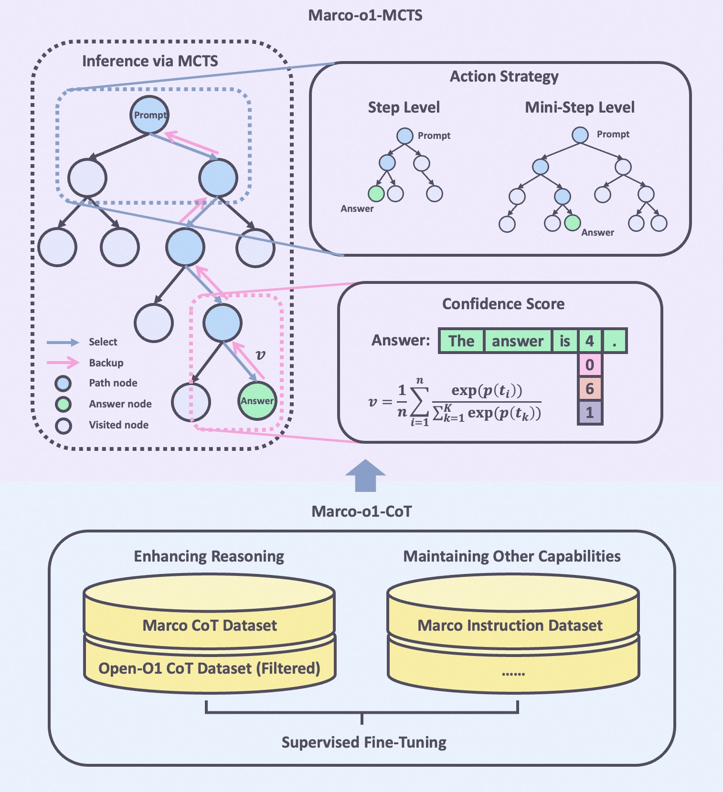
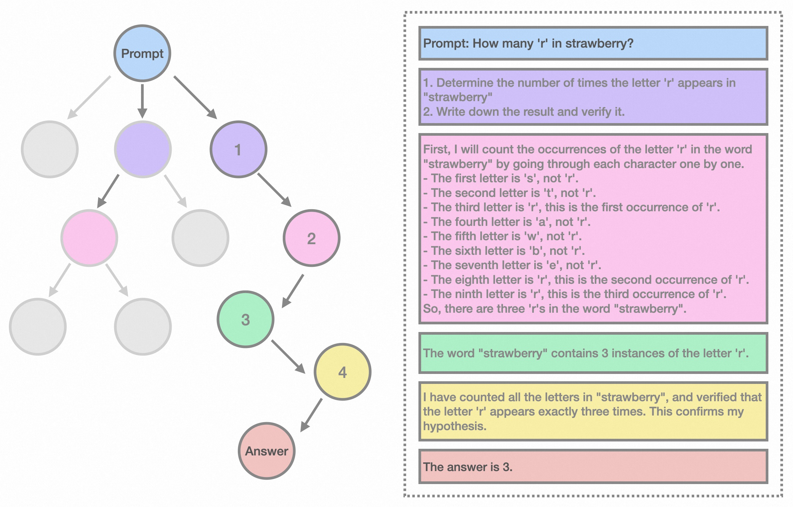
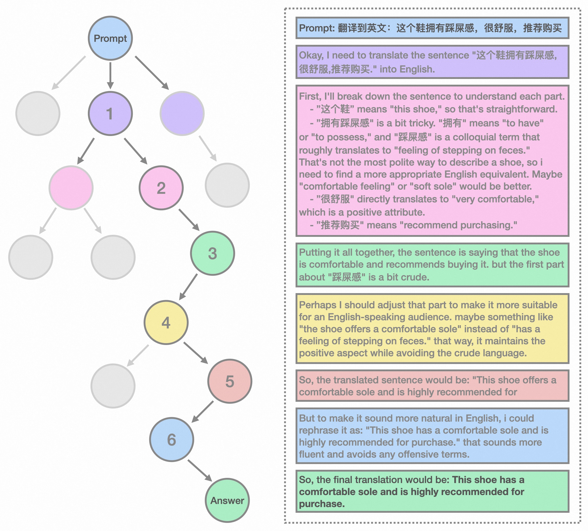
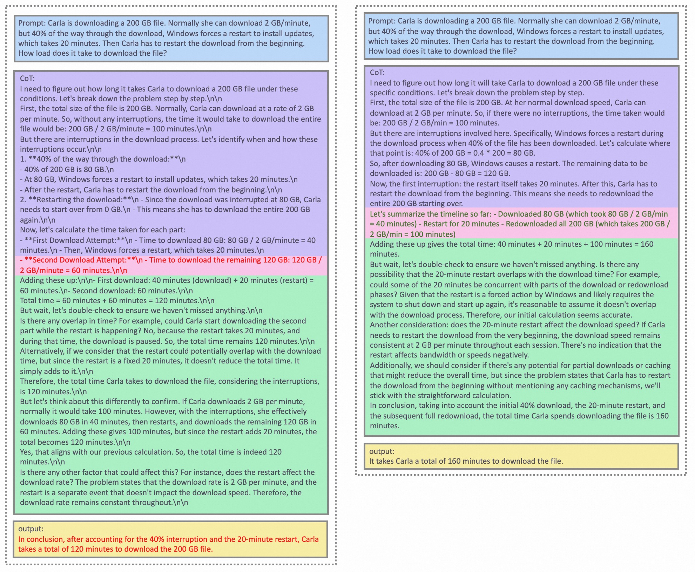
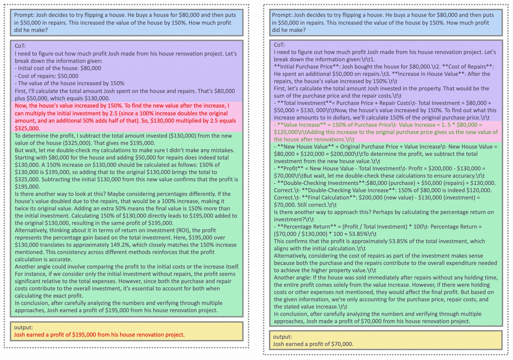
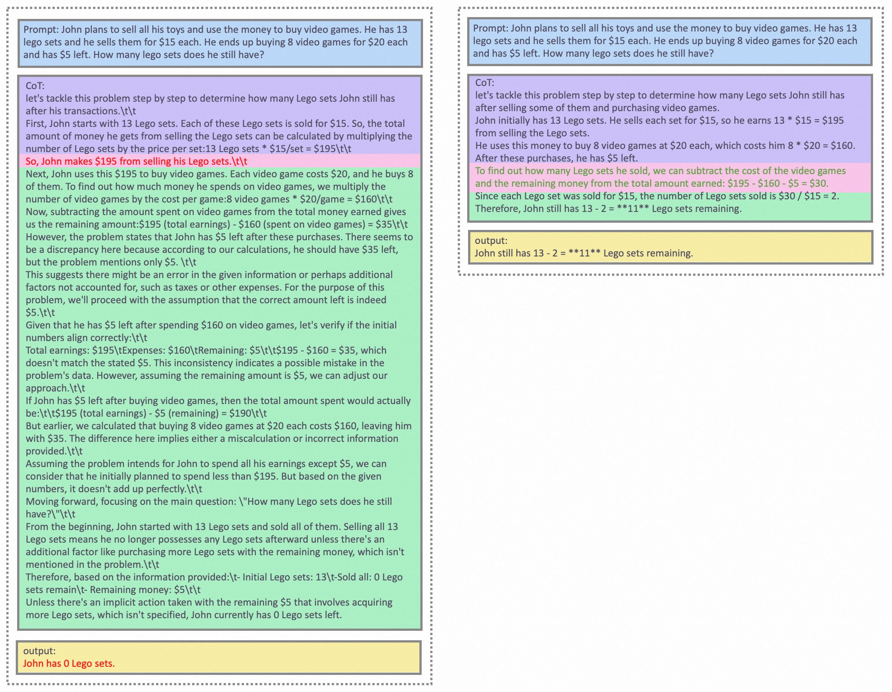

<p align="center">
    
<p>
<h2 align="center"> <a href="https://github.com/AIDC-AI/Marco-o1/">Marco-o1</a></h2>
<h5 align="center"> If you appreciate our project, please consider giving us a star ⭐ on GitHub to stay updated with the latest developments.  </h2>
 
<h4 align="center">

🚀 Welcome to the repo of **Marco-o1**!

[](https://huggingface.co/) [](https://github.com/AIDC-AI/Marco-o1/)

<div align="center">
 


<br>
<br>
Yu Zhao, Huifeng Yin, Longyue Wang

</h4>

## 🔥 News

- [2024/10/27] 🔥 We released **Marco-o1**. This initial release includes our reasoning model, optimized for complex problem-solving and versatile applications across various domains.


## Introduction

OpenAI recently unveiled the revolutionary o1 model, which, with its exceptional reasoning capabilities, has excelled on platforms like AIME, CodeForces, and LeetCode Pro Max, surpassing other leading models. Inspired by this achievement and given our Marco team's specialization in multilingual and translation, we recognized the inherent challenges in translation—such as the need to accurately handle difficult terms, including internet slang, colloquial expressions, specialized terminology, and emerging new words. To address these complexities, we have replicated and extended the o1 model's technical roadmap with a stronger focus on multilingual and translation tasks, while also considering general reasoning capabilities. We are proud to introduce Marco-o1, which further enhances the model's reasoning performance through innovative methodologies designed to meet the unique demands of translation tasks.

<div align="center">
  
  <p><strong>Figure 1: </strong>Overview of the Marco-o1</p>
</div>

Our main contributions are threefold: 
- **Fine-Tuning with CoT Data:** We developed Marco-o1-CoT by performing full-parameter fine-tuning on the base model using open-source Chain-of-Thought (CoT) data combined with our self-developed synthetic data. 
- **Solution Space Expansion via MCTS:** We integrated Large Language Models (LLMs) with Monte Carlo Tree Search (MCTS), using the model's output confidence to guide the search and expand the solution space. 
- **Reasoning Action Strategy:** We implemented novel reasoning action strategies and a reflection mechanism, including exploring different action granularities within the MCTS framework and prompting the model to self-reflect, thereby significantly enhancing the model's ability to solve complex problems.
- **Application in Translation Tasks:** We are the first to apply Large Reasoning Models(LRM) to translation tasks, exploring inference time scaling laws in the multilingual and translation domain.


## 🎨 Case Show

This is a classic example from our Marco-o1 model, "How many 'r's are in the word 'strawberry'?" Through multiple search steps, the correct answer was obtained, as shown in Figure 2. Although we tested general reasoning capabilities, our primary focus is on tackling challenging translation problems. An example of this focus is shown in Figure 3, illustrating the translation of the sentence "This shoe has a comfortable sole and is highly recommended for purchase."

<div align="center">
  
  <p><strong>Figure 2: </strong>Reasoning example of "How many 'r' are in strawberry"</p>
</div>

<div align="center">
  
  <p><strong>Figure 3: </strong>Translation example of "This shoe has a comfortable sole and is highly recommended for purchase."</p>
</div>


## Fine-Tuning with CoT Data

To enhance the reasoning capabilities of the Marco-o1 model, we conducted fine-tuning using a combination of datasets tailored to improve various aspects of the model's performance. We utilized the Marco Reasoning Dataset, specifically developed to challenge and enhance the model's ability to handle complex reasoning tasks. Additionally, we employed the Chain-of-Thought (CoT) Dataset, originally proposed in the Open-O1 project, which we refined through a filtering process to ensure high-quality data for training. This filtered CoT Dataset helps the model leverage structured reasoning patterns, thereby improving its capability to follow logical steps in problem-solving. Furthermore, to maintain the model's general competencies across various tasks, we incorporated the Marco Instruction Dataset along with other diverse datasets. This combination allows the model to retain proficiency in a wide range of domains and tasks, ensuring well-rounded performance. By collectively employing these datasets during fine-tuning, we significantly enhanced the reasoning prowess of the Marco-o1 model while preserving its overall effectiveness in broader applications. This strategic balance of data optimizes the model for its primary goal of reasoning without compromising its utility in other areas.


## Solution Space Expansion via MCTS

We integrated Large Language Models (LLMs) with Monte Carlo Tree Search (MCTS) to enhance the reasoning capabilities of our model. Here's how the combination works:

- **Nodes as Reasoning States:** In the MCTS framework, each node represents a reasoning state of the problem-solving process.
- **Actions as LLM Outputs:** The possible actions from a node are the outputs generated by the LLM. These outputs represent potential steps or thoughts in the reasoning chain.
- **Rollout and Reward Calculation:** During the rollout phase, the LLM continues the reasoning process to a terminal state. We obtain the value of this state by computing a confidence score using the following formulas:
1. **Confidence Score ($c_i$):**

   For each token $t_i$ generated during the rollout, we calculate its confidence score by applying the softmax function to its log probability and the log probabilities of the top 5 alternative tokens. This is given by:

   $$c_i = \frac{\exp(p(t_i))}{\sum_{k=1}^{5} \exp(p(t_k))}$$

   **Where:**

    - $c_i$ is the confidence score for the $i^{th}$ token in the rollout.
    - $p(t_i)$ is the log probability of the $i^{th}$ token generated by the LLM.
    - $p(t_k)$ for $k = 1$ to $5$ are the log probabilities of the top 5 predicted tokens at the $i^{th}$ step.
    - $n$ is the total number of tokens in the rollout sequence.

   This equation ensures that the confidence score reflects the relative probability of the chosen token compared to the top alternatives, effectively normalizing the scores between 0 and 1.
  
2. **Reward Score ($R$):**

   After obtaining the confidence scores for all tokens in the rollout sequence, we compute the average confidence score across all tokens to derive the overall reward score:

   $$R = \frac{1}{n} \sum_{i=1}^{n} c_i$$

   **Where:**

   - $R$ is the overall reward score for the rollout path.

   This average serves as the reward signal that evaluates the quality of the reasoning path taken during the rollout. A higher $R$ indicates a more confident and likely accurate reasoning path.

- **Guiding MCTS:** This reward score $R$ is used to evaluate and select promising paths within the MCTS, effectively guiding the search towards more confident and reliable reasoning chains.

By employing this method, we effectively expand the solution space, as shown in Figure 2, allowing the model to explore a vast array of reasoning paths and select the most probable ones based on calculated confidence scores.


## Reasoning Action Strategy

### Action Selection

To enhance our model's reasoning capabilities and effectively expand its solution space, we explored different granularity levels for actions within the Monte Carlo Tree Search (MCTS) framework. Specifically, we considered three approaches:

1. **Thought as Action:** Each action corresponds to an entire thought or reasoning step.

2. **Token as Action:** At the other end of the spectrum, each action is a single token generated by the model.

3. **Patch as Action:** Serving as a middle ground between the two, we introduced "patches"—fixed-length sequences of tokens (e.g., 32 or 64 tokens)—as actions.

In our experiments, we employed both the **Thought as Action** and **Patch as Action** strategies within the MCTS framework:

- **Thought as Action:** We allowed the model to generate complete thoughts as actions, enabling it to take significant reasoning steps during the search process.
- **Patch as Action:** We used patches of 32 or 64 tokens as actions, allowing the model to explore reasoning paths at a finer granularity than whole thoughts but coarser than individual tokens.

By integrating these strategies, we expanded the solution space and improved the model's ability to navigate complex reasoning tasks. This combination allowed us to leverage the strengths of both approaches—efficient search and detailed exploration—leading to better performance in problem-solving scenarios.

### Reflection after Thinking

We introduced a reflection mechanism by adding the phrase **"Wait! Maybe I made some mistakes! I need to rethink from scratch."** at the end of each thought process. This prompts the model to self-reflect and reevaluate its reasoning steps. Implementing this reflection has yielded significant improvements, especially on difficult problems that the original model initially solved incorrectly. With the addition of reflection, approximately half of these challenging problems were answered correctly.

From the self-critic perspective, this approach allows the model to act as its own critic, identifying potential errors in its reasoning. By explicitly prompting the model to question its initial conclusions, we encourage it to re-express and refine its thought process. This self-critical mechanism leverages the model's capacity to detect inconsistencies or mistakes in its own output, leading to more accurate and reliable problem-solving. The reflection step serves as an internal feedback loop, enhancing the model's ability to self-correct without external intervention.

## Experimental Results

Based on Qwen2-7B-Instruct, we performed supervised fine-tuning using CoT data to create Marco-o1-CoT. Subsequently, we employed Marco-o1-CoT within the framework of MCTS tree search, differentiating by actions:

- **Using each inference step as an action (Step).**
- **Using a 64-token patch as an action (64 Patch).**
- **Using a 32-token patch as an action (32 Patch).**

During testing, each model utilized a CoT prompt to ensure consistency in reasoning processes.

We then tested these configurations on the English and Chinese subsets of the mgsm dataset, obtaining the following results:

| **Model**                | **mgsm-en (Acc.)** | **mgsm-zh (Acc.)** |
|--------------------------|--------------------|--------------------|
| Qwen2-7B-Instruct        | 84.23%             | 76.80%             |
| Marco-o1-CoT             | 85.60%             | 71.20%             |
| Marco-o1-MCTS (Step)     | 90.40%             | 80.00%             |
| Marco-o1-MCTS (64 Patch) | 88.40%             | 80.40%             |
| Marco-o1-MCTS (32 Patch) | 87.60%             | 82.40%             |

These results demonstrate:

1. Performance of Marco-o1-CoT vs. Qwen2-7B-Instruct:

   - In the mgsm-en dataset, Marco-o1-CoT shows an advantage over Qwen2-7B-Instruct, as shown in Figure 4, which is expected due to the fine-tuning with English CoT data.
   - In the mgsm-zh dataset, however, Marco-o1-CoT exhibits a decrease in performance compared to Qwen2-7B-Instruct. This decline is attributed to the fact that the CoT data used for fine-tuning was in English, which may not transfer effectively to the Chinese dataset.

2. Impact of MCTS Integration:

   - The three MCTS-enhanced models demonstrate improvements over Marco-o1-CoT, indicating that incorporating MCTS helps to expand the model's solution space and increase the probability of obtaining correct answers.
   - However, since we use the Confidence Score as the reward, the tree search results exhibit significant randomness. In mgsm-en, the "Thought as Action" strategy performs the best, while in mgsm-zh, the "Patch as Action (32)" strategy yields the highest accuracy.
   - Currently, as shown in Figure 5-6, we cannot draw definitive conclusions about which action strategy is superior. We believe that as the reward becomes more accurate, the larger solution space provided by MCTS will demonstrate greater potential.

<div align="center">
  
  <p><strong>Figure 4: </strong>Marco-o1-CoT got it wrong (left), Marco-o1-MCTS (Step) got it right (right) in the MGSM dataset</p>
</div>

<div align="center">
  
  <p><strong>Figure 5: </strong>Marco-o1-MCTS (Step) got it wrong (left), Marco-o1-MCTS (32 Patch) got it right (right) in the MGSM dataset</p>
</div>

<div align="center">
  
  <p><strong>Figure 6: </strong>Marco-o1-MCTS (64 Patch) got it wrong (left), Marco-o1-MCTS (Step) got it right (right) in the MGSM dataset</p>
</div>

These results demonstrate the effectiveness of our approach in enhancing the reasoning capabilities of the model across different languages and configurations.


## ⚡️ Available Models and Datasets

[Marco-o1](https://huggingface.co) (Our Reasoning Model)

[Marco Reasoning Dataset](https://huggingface.co) (Our Dataset)

## Installation

To install Marco-o1, follow these steps:

```bash
# Clone the repository
git clone https://github.com/AIDC-AI/Marco-o1

# Change to the Macaw-LLM directory
cd Marco-o1

# Install required packages
pip install -r requirements.txt

```

## Usage 🚀

1. **Downloading Marco-o1-CoT model:** 
   


2. **Inference:** 
   - Execute the inference script (you can give any customized inputs inside):
     ```
     ./src/talk_with_model.py

     # Use vLLM
     ./src/talk_with_model_vllm.py

     ```


## Coming Soon

This is our initial version, and we will continue to update and enhance the model's reasoning capabilities.

1. **Training Reward Models:** We are working on training reward models, including Outcome Reward Modeling (ORM) and Policy Reward Modeling (PRM), to provide a more accurate reward signal for MCTS. A more precise reward function will help reduce randomness in tree search results and improve overall performance.

2. **Reinforcement Learning Training:** We are conducting reinforcement learning training to develop better reasoning models. By utilizing RL techniques, we aim to refine the model's decision-making processes and further enhance its problem-solving abilities.


## Citation

If you find Marco-o1 useful for your research and applications, please cite:

```
@misc{zhao-etal-2024-marco-o1,
author = {Yu Zhao, Huifeng Yin, Longyue Wang},
title = {Marco-o1},
year = {2024},
publisher = {GitHub},
journal = {GitHub repository},
howpublished = {\url{https://github.com/AIDC-AI/Marco-o1}}
}
```


## LICENSE

This project is licensed under [Apache License Version 2](https://huggingface.co/datasets/choosealicense/licenses/blob/main/markdown/apache-2.0.md) (SPDX-License-identifier: Apache-2.0).

## DISCLAIMER

We used compliance checking algorithms during the training process, to ensure the compliance of the trained model and dataset to the best of our ability. Due to complex data and the diversity of language model usage scenarios, we cannot guarantee that the model is completely free of copyright issues or improper content. If you believe anything infringes on your rights or generates improper content, please contact us, and we will promptly address the matter.
