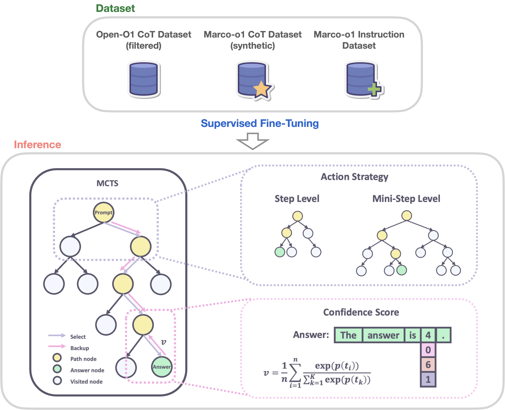
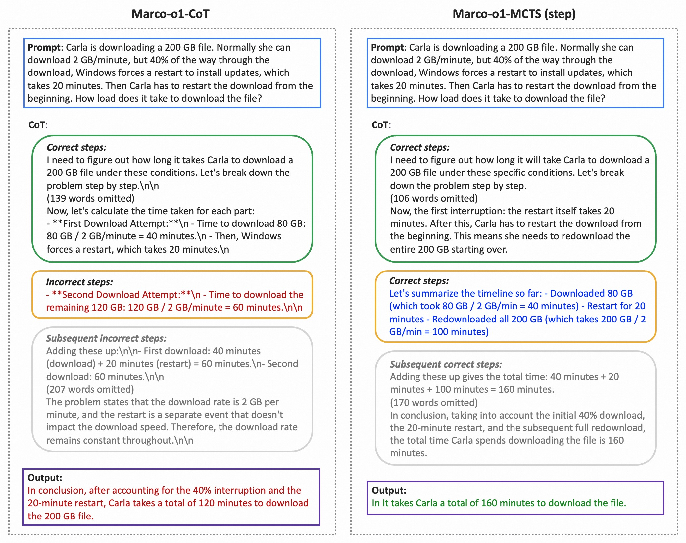
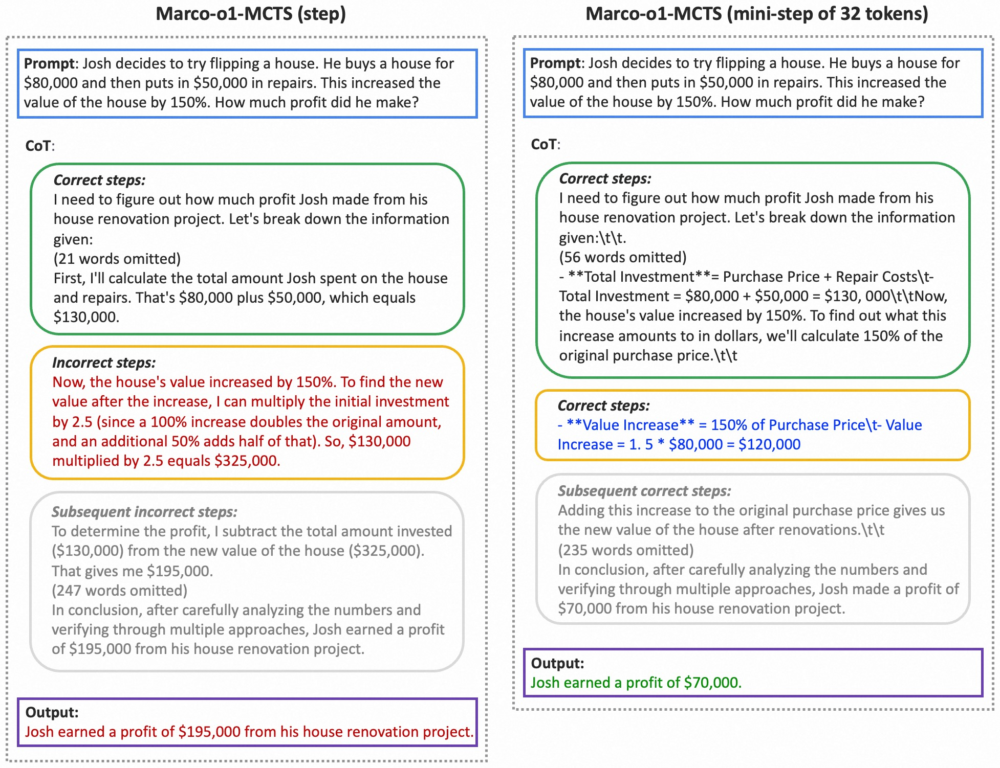
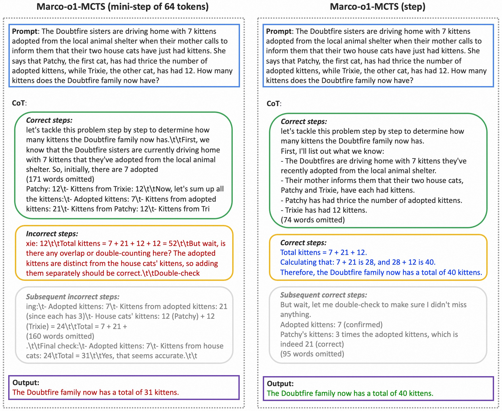

<p align="center">
    
<p>

# 🍓 Marco-o1: Towards Open Reasoning Models for Open-Ended Solutions

<!-- Broader Real-World Applications -->

<!-- # 🍓 Marco-o1: An Open Large Reasoning Model for Real-World Solutions -->

<!-- <h2 align="center"> <a href="https://github.com/AIDC-AI/Marco-o1/">Marco-o1</a></h2> -->
<!-- <h5 align="center"> If you appreciate our project, please consider giving us a star ⭐ on GitHub to stay updated with the latest developments.  </h2> -->
 
<h4 align="center">

<!-- [](https://huggingface.co/) [](https://github.com/AIDC-AI/Marco-o1/) -->


<div align="center">
 


</h4>

<div align="center">

<!-- **Affiliations:** -->

⭐ _**MarcoPolo Team**_ ⭐

[_**Alibaba International Digital Commerce**_](https://aidc-ai.com)

:octocat: [**Github**](https://github.com/AIDC-AI/Marco-o1)  🤗  [**Hugging Face**](https://huggingface.co/AIDC-AI/Marco-o1) 📝  [**Paper**]() 🧑‍💻 [**Model**](#models-and-datasets) 🗂️  [**Data**](#models-and-datasets) 📽️  [**Demo**]()

</div>

#

🎯 **Marco-o1** not only focuses on disciplines with standard answers, such as mathematics, physics, and coding—which are well-suited for reinforcement learning (RL)—but also places greater emphasis on **open-ended resolutions**. We aim to address the question: _"Can the o1 model effectively generalize to broader domains where clear standards are absent and rewards are challenging to quantify?"_

Currently, Marco-o1 Large Language Model (LLM) is powered by _Chain-of-Thought (CoT) fine-tuning_, _Monte Carlo Tree Search (MCTS)_, _reflection mechanisms_, and _innovative reasoning strategies_—optimized for complex real-world problem-solving tasks. 

<div align="center">
</div>

<div align="center">
  
  <p><strong>Figure 1: </strong> A classic 'strawberry' question reasoned by our Marco-o1 model: "How many 'r' are in strawberry".</p>
</div>

## 🚀 Highlights

Currently, our work is distinguished by the following highlights:
- 🍀 **Fine-Tuning with CoT Data:** We develop <ins>Marco-o1-CoT</ins> by performing full-parameter fine-tuning on the base model using open-source CoT dataset combined with our self-developed synthetic data. 
- 🍀 **Solution Space Expansion via MCTS:** We integrate LLMs with MCTS (<ins>Marco-o1-MCTS</ins>), using the model's output confidence to guide the search and expand the solution space. 
- 🍀 **Reasoning Action Strategy:** We implement novel reasoning action strategies and a reflection mechanism (<ins>Marco-o1-MCTS mini-step</ins>), including exploring different action granularities within the MCTS framework and prompting the model to self-reflect, thereby significantly enhancing the model's ability to solve complex problems.
- 🍀 **Application in Translation Tasks:** We are the first to apply Large Reasoning Models (LRM) to <ins>Machine Translation task</ins>, exploring inference time scaling laws in the multilingual and translation domain.

## 🔥 News

<!-- ## Coming Soon -->

<!-- This is our initial version, and we will continue to update and enhance the model's reasoning capabilities. -->

1. [Coming Soon] 🏃 **Reward Models:** We are working on training reward models, including Outcome Reward Modeling (ORM) and Process Reward Modeling (PRM), to provide a more accurate reward signal for MCTS. A more precise reward function will help reduce randomness in tree search results and improve overall performance.

2. [Coming Soon] 🏃 **Reinforcement Learning:** We are conducting reinforcement learning training to develop better reasoning models. By utilizing RL techniques, we aim to refine the model's decision-making processes and further enhance its problem-solving abilities.

- [2024/11/13] 🔥 We released **Marco-o1**. This initial release includes our reasoning model, optimized for complex problem-solving and versatile applications across various domains.


## 🔔 Introduction

OpenAI recently introduced the groundbreaking o1 model, renowned for its exceptional reasoning capabilities. This model has demonstrated outstanding performance on platforms such as AIME and CodeForces, surpassing other leading models. Inspired by this success, we aimed to push the boundaries of LLMs even further, enhancing their reasoning abilities to tackle complex, real-world challenges.

🌍 Marco-o1 leverages advanced techniques like CoT fine-tuning, MCTS, and Reasoning Action Strategies to enhance its reasoning power. As shown in Figure 2, by fine-tuning Qwen2-7B-Instruct with a combination of the filtered Open-O1 CoT dataset, Marco-o1 CoT dataset, and Marco-o1 Instruction dataset, Marco-o1 improved its handling of complex tasks. MCTS allows exploration of multiple reasoning paths using confidence scores derived from softmax-applied log probabilities of the top-k alternative tokens, guiding the model to optimal solutions. Moreover, our reasoning action strategy involves varying the granularity of actions within steps and mini-steps to optimize search efficiency and accuracy.

<div align="center">
  
  <p><strong>Figure 2: </strong>The overview of Marco-o1.</p>
</div>

🌏 As shown in Figure 3, Marco-o1 achieved accuracy improvements of +6.17% on the MGSM (English) dataset and +5.60% on the MGSM (Chinese) dataset, showcasing enhanced reasoning capabilities. 

<div align="center">
  
  <p><strong>Figure 3: </strong>The main results of Marco-o1.</p>
</div>

🌎 Additionally, in translation tasks, we demonstrate that Marco-o1 excels in translating slang expressions, such as translating "这个鞋拥有踩屎感" (literal translation: "This shoe offers a stepping-on-poop sensation.") to "This shoe has a comfortable sole," demonstrating its superior grasp of colloquial nuances.

<div align="center">
  
  <p><strong>Figure 4: </strong>The demostration of translation task using Marco-o1.</p>
</div>

<!-- ## 🎨 Case Show

This is a classic example from our Marco-o1 model, "How many 'r's are in the word 'strawberry'?" Through multiple search steps, the correct answer was obtained, as shown in Figure 2. Although we tested general reasoning capabilities, our primary focus is on tackling challenging translation problems. An example of this focus is shown in Figure 3, illustrating the translation of the sentence "This shoe has a comfortable sole and is highly recommended for purchase."
 -->
<!-- <div align="center">
  
  <p><strong>Figure 2: </strong>Reasoning example of "How many 'r' are in strawberry"</p>
</div> -->


## 📚 Marco Reasoning Datasets

To enhance the reasoning capabilities of the Marco-o1 model, we employed a 
SFT strategy using a variety of datasets. 

- 📊 **Open-O1 CoT Dataset (Filtered):** We refined the Open-O1 project's CoT Dataset by applying heuristic and quality filtering processes. This enhancement allowed the model to adopt structured reasoning patterns effectively.

- 📊 **Marco-o1 CoT Dataset (Synthetic):** We generated the Marco-o1 CoT Dataset using MCTS, which helped to formulate complex reasoning pathways, further bolstering the model's reasoning capabilities.

- 📊 **Marco Instruction Dataset:** Recognizing the critical role of robust instruction-following capabilities in executing complex tasks, we incorporated a set of instruction-following data. This integration ensures the model remains competent across a wide range of tasks, maintaining its general effectiveness while significantly boosting its reasoning flair.

| Dataset            | \#Samples |
|--------------------|-----------------|
| Open-O1 CoT Dataset (Filtered)        | 45,125           |
| Marco-o1 CoT Dataset (Synthetic)         | 10,000           |
| Marco Instruction Dataset| 5,141            |
| **Total**              | **60,266**           |

📥 [Marco Reasoning Dataset](https://github.com/AIDC-AI/Marco-o1/blob/main/data/CoT_demo.json) (Our Partial Dataset)

## 🌟 Solution Space Expansion via MCTS

We integrated LLMs with MCTS to enhance the reasoning capabilities of our Marco-o1  model:

- 💎 **Nodes as Reasoning States:** In the MCTS framework, each node represents a reasoning state of the problem-solving process.
- 💎 **Actions as LLM Outputs:** The possible actions from a node are the outputs generated by the LLM. These outputs represent potential steps or mini-steps in the reasoning chain.
- 💎 **Rollout and Reward Calculation:** During the rollout phase, the LLM continues the reasoning process to a terminal state. 
- 💎 **Guiding MCTS:** This reward score $R$ is used to evaluate and select promising paths within the MCTS, effectively guiding the search towards more confident and reliable reasoning chains.

Furthermore, we obtain the value of each state by computing a confidence score using the following formulas:
1. **Confidence Score ($c_i$):**

   For each token $t_i$ generated during the rollout, we calculate its confidence score by applying the softmax function to its log probability and the log probabilities of the top 5 alternative tokens. This is given by:

    $$c_i = \frac{\exp(p(t_i))}{\sum_{k=1}^{5} \exp(p(t_k))}$$
    
    **where:**

    - $c_i$ is the confidence score for the $i^{th}$ token in the rollout.
    - $p(t_i)$ is the log probability of the $i^{th}$ token generated by the LLM.
    - $p(t_k)$ for $k = 1$ to $5$ are the log probabilities of the top 5 predicted tokens at the $i^{th}$ step.
    - $n$ is the total number of tokens in the rollout sequence.

   This equation ensures that the confidence score reflects the relative probability of the chosen token compared to the top alternatives, effectively normalizing the scores between 0 and 1.
  
2. **Reward Score ($v$):**

   After obtaining the confidence scores for all tokens in the rollout sequence, we compute the average confidence score across all tokens to derive the overall reward score:

   $$v = \frac{1}{n} \sum_{i=1}^{n} c_i$$

   **where:** $v$ is the overall reward score for the rollout path.

   This average serves as the reward signal that evaluates the quality of the reasoning path taken during the rollout. A higher $v$ indicates a more confident and likely accurate reasoning path.

By employing this method, we effectively expand the solution space, allowing the model to explore a vast array of reasoning paths and select the most probable ones based on calculated confidence scores.


## 🌟 Reasoning Action Strategy

### ✨ Action Selection

We observed that using actions as the granularity for MCTS search is relatively coarse, often causing the model to overlook nuanced reasoning paths crucial for solving complex problems. To address this, we explored different levels of granularity in the MCTS search. Initially, we used steps as the unit of search. To further expand the model's search space and enhance its problem-solving capabilities, we experimented with dividing these steps into smaller units of 64 or 32 tokens, referred to as "mini-step." This finer granularity allowed the model to explore reasoning paths in greater detail. While token-level search offers theoretical maximum flexibility and granularity, it is currently impractical due to the significant computational resources required and the challenges associated with designing an effective reward model at this level.

In our experiments, we implemented the following strategies within the MCTS framework:

- 💎 **step as Action:** We allowed the model to generate complete reasoning steps as actions. Each MCTS node represents an entire thought or action label. This method enables efficient exploration but may miss finer-grained reasoning paths essential for complex problem-solving.

- 💎 **mini-step as Action:** We used mini-steps of 32 or 64 tokens as actions. This finer granularity expands the solution space and improves the model's ability to navigate complex reasoning tasks by considering more nuanced steps in the search process. By exploring the solution space at this level, the model is better equipped to find correct answers that might be overlooked with larger action units.

### ✨ Reflection after Thinking

We introduced a reflection mechanism by adding the phrase **"Wait! Maybe I made some mistakes! I need to rethink from scratch."** at the end of each thought process. This prompts the model to self-reflect and reevaluate its reasoning steps. Implementing this reflection has yielded significant improvements, especially on difficult problems that the original model initially solved incorrectly. With the addition of reflection, approximately half of these challenging problems were answered correctly.

From the self-critic perspective, this approach allows the model to act as its own critic, identifying potential errors in its reasoning. By explicitly prompting the model to question its initial conclusions, we encourage it to re-express and refine its thought process. This self-critical mechanism leverages the model's capacity to detect inconsistencies or mistakes in its own output, leading to more accurate and reliable problem-solving. The reflection step serves as an internal feedback loop, enhancing the model's ability to self-correct without external intervention.

## 🎯 Experimental Results

Based on 💡 [Qwen2-7B-Instruct](https://huggingface.co/Qwen/Qwen2-7B-Instruct), we performed SFT using our training data to create 💡 **Marco-o1-CoT**. Besides, we employed Marco-o1-CoT within the framework of MCTS tree search, differentiating by actions:

- 💡 **Marco-o1-MCTS (step)**: using each inference step as an action (step).
- 💡 **Marco-o1-MCTS (mini-step of 64 tokens)**: using a 64-token mini-step as an action (64 tokens).
- 💡 **Marco-o1-MCTS (mini-step of 64 tokens)**: using a 32-token mini-step as an action (32 tokens).

During testing, each model utilized a CoT prompt to ensure consistency in reasoning processes. We then tested these configurations on the English (En) and Chinese (Zh) subsets of the [MGSM dataset](https://huggingface.co/datasets/juletxara/mgsm), obtaining the following results:

| **Model**                | **MGSM-En (Acc.)** | **MGSM-Zh (Acc.)** |
|--------------------------|--------------------|--------------------|
| Qwen2-7B-Instruct        | 84.23%             | 76.80%             |
| Marco-o1-CoT             | 85.60%             | 71.20%             |
| Marco-o1-MCTS (step)     | 90.40%             | 80.00%             |
| Marco-o1-MCTS (mini-step of 64 tokens) | 88.40%             | 80.40%             |
| Marco-o1-MCTS (mini-step of 32 tokens) | 87.60%             | 82.40%             |

📥 [Marco-o1-CoT](https://huggingface.co/AIDC-AI/Marco-o1) (Our Lastest Model)

🔬 These results demonstrate that:

1. **Performance of Marco-o1-CoT vs. Qwen2-7B-Instruct**:

   - In the MGSM-en dataset, Marco-o1-CoT shows an advantage over Qwen2-7B-Instruct, as shown in Figure 4, which is expected due to the fine-tuning with English CoT data.
   - In the MGSM-zh dataset, however, Marco-o1-CoT exhibits a decrease in performance compared to Qwen2-7B-Instruct. This decline is attributed to the fact that the CoT data used for fine-tuning was in English, which may not transfer effectively to the Chinese dataset.

2. **Impact of MCTS Integration**:

   - The three MCTS-enhanced models demonstrate improvements over Marco-o1-CoT, indicating that incorporating MCTS helps to expand the model's solution space and increase the probability of obtaining correct answers.
   - However, since we use the Confidence Score as the reward, the tree search results exhibit significant randomness. In MGSM-en, the "step as Action" strategy performs the best, while in MGSM-zh, the "mini-step as Action (32)" strategy yields the highest accuracy.
   - Currently, as shown in Figure 5-6, we cannot draw definitive conclusions about which action strategy is superior. We believe that as the reward becomes more accurate, the larger solution space provided by MCTS will demonstrate greater potential.

<div align="center">
  
  <p><strong>Figure 4: </strong>MCTS Expands the Solution Space for Correct Answers. Comparison between Marco-o1-CoT (left) and Marco-o1-MCTS (step) (right) on the MGSM dataset. While Marco-o1-CoT failed to provide the correct answer, integrating MCTS with step-level actions allowed the model to explore a broader solution space, increasing the likelihood of arriving at the correct solution.</p>
</div>

<div align="center">
  
  <p><strong>Figure 5: </strong>Finer Granularity with mini-steps Enhances Problem-Solving. Comparison between Marco-o1-MCTS (step) (left) and Marco-o1-MCTS (mini-step of 32 tokens) (right) on the MGSM dataset. The step-level action strategy did not yield the correct answer, but by using a finer-grained mini-step of 32 tokens, the model successfully navigated the solution space to find the correct answer, demonstrating the effectiveness of increased action granularity.</p>
</div>

<div align="center">
  
  <p><strong>Figure 6: </strong>Optimal Action Granularity Depends on Problem Complexity. Comparison between Marco-o1-MCTS (mini-step of 64 tokens) (left) and Marco-o1-MCTS (step) (right) on the MGSM dataset. The model with a mini-step of 64 tokens failed to find the correct answer, whereas using step-level actions enabled the model to correctly solve the problem. This highlights that we cannot draw definitive conclusions about which action strategy is superior. We believe that as the reward becomes more accurate, the larger solution space provided by MCTS will demonstrate greater potential. </p>
</div>

These results demonstrate the effectiveness of our approach in enhancing the reasoning capabilities of the model across different languages and configurations.

## Case Study of Translation Task

We have also conducted some open-ended tests on our models, such as translation issues and achieved some positive results. In the future, we will continue to explore other areas and improve the model's related performance.

<div align="center">
  
  <p><strong>Figure 7: </strong>The translation for our case is shown above, with the translation difficulties highlighted. Google Translate can make mistakes with words like "Madam" and "Korean." Our model can correctly understand these colloquial terms and provide accurate translations.</p>
</div>


# ⚡️ Released Resources

## Models and Datasets

📥 [Marco-o1-CoT](https://huggingface.co/AIDC-AI/Marco-o1) (Our Lastest Model)

📥 [Marco Reasoning Dataset](https://github.com/AIDC-AI/Marco-o1/blob/main/data/CoT_demo.json) (Our Partial Dataset)

## Installation

To install Marco-o1, follow these steps:

```bash
# Clone the repository
git clone https://github.com/AIDC-AI/Marco-o1

# Change to the Macaw-LLM directory
cd Marco-o1

# Install required packages
pip install -r requirements.txt

```

## Usage

1. **Load Marco-o1-CoT model:** 
    ```
    # Load model directly
    from transformers import AutoTokenizer, AutoModelForCausalLM

    tokenizer = AutoTokenizer.from_pretrained("AIDC-AI/Marco-o1")
    model = AutoModelForCausalLM.from_pretrained("AIDC-AI/Marco-o1")
    ```

2. **Inference:** 

    Execute the inference script (you can give any customized inputs inside):
    ```
    ./src/talk_with_model.py

    # Use vLLM
    ./src/talk_with_model_vllm.py
    ```


# 👨🏻‍💻 Acknowledgement

## Main Contributors
From MarcoPolo Team, AI Business, Alibaba International Digital Commerce:
- Yu Zhao
- [Huifeng Yin](https://github.com/HuifengYin)
- Hao Wang
- [Longyue Wang](http://www.longyuewang.com)

## Citation

If you find Marco-o1 useful for your research and applications, please cite:

```
@misc{zhao-etal-2024-marco-o1,
author = {Yu Zhao, Huifeng Yin, Longyue Wang},
title = {Marco-o1},
year = {2024},
publisher = {GitHub},
journal = {GitHub repository},
howpublished = {\url{https://github.com/AIDC-AI/Marco-o1}}
}
```

## LICENSE

This project is licensed under [Apache License Version 2](https://huggingface.co/datasets/choosealicense/licenses/blob/main/markdown/apache-2.0.md) (SPDX-License-identifier: Apache-2.0).

## DISCLAIMER

We used compliance checking algorithms during the training process, to ensure the compliance of the trained model and dataset to the best of our ability. Due to complex data and the diversity of language model usage scenarios, we cannot guarantee that the model is completely free of copyright issues or improper content. If you believe anything infringes on your rights or generates improper content, please contact us, and we will promptly address the matter.
