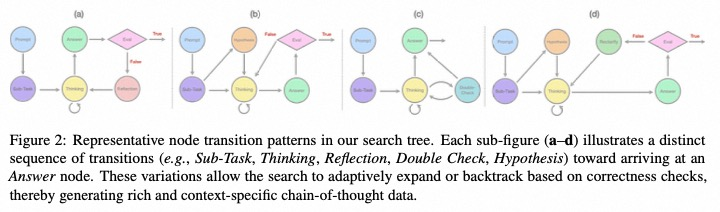
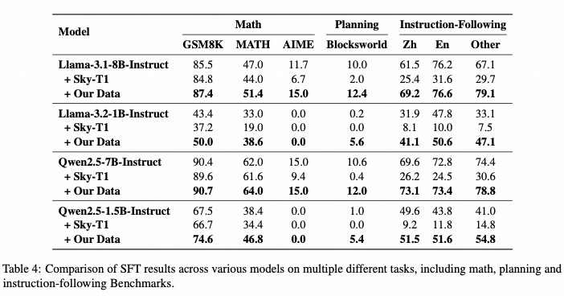
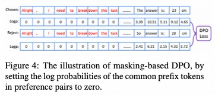
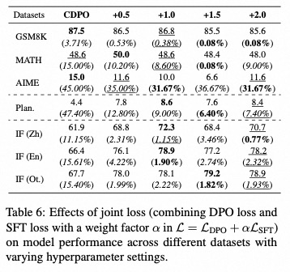
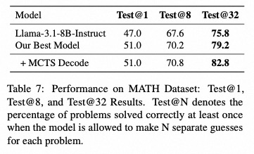

<p align="center">
    
<p>

# 🍓 Marco-o1 v2: Towards Widening The Distillation Bottleneck for Reasoning Models

<!-- Broader Real-World Applications -->

<!-- # 🍓 Marco-o1: An Open Large Reasoning Model for Real-World Solutions -->

<!-- <h2 align="center"> <a href="https://github.com/AIDC-AI/Marco-o1/">Marco-o1</a></h2> -->
<!-- <h5 align="center"> If you appreciate our project, please consider giving us a star ⭐ on GitHub to stay updated with the latest developments.  </h2> -->
 
<h4 align="center">

<!-- [](https://huggingface.co/) [](https://github.com/AIDC-AI/Marco-o1/) -->


<div align="center">
 


</h4>

<div align="center">

<!-- **Affiliations:** -->

⭐ _**MarcoPolo Team**_ ⭐

[_**Alibaba International Digital Commerce**_](https://aidc-ai.com)

:octocat: [**Github**](https://github.com/AIDC-AI/Marco-o1)  🤗  [**Hugging Face**](https://huggingface.co/AIDC-AI/Marco-o1) 📝  [**Paper**](https://arxiv.org/abs/2503.01461) 🧑‍💻 [**Model**](https://huggingface.co/AIDC-AI/Marco-o1) 🗂️  [**Data**](https://github.com/AIDC-AI/Marco-o1/tree/main/data) 📽️  [**Demo**](https://huggingface.co/AIDC-AI/Marco-o1)

</div>


## 🔔 Introduction

Building on Marco-o1 v1, we continued to release Marco-o1 v2 with the aim of addressing some of the shortcomings in v1. 
In this version, we no longer utilize CoT data from any other sources, including open-source inference data like Open-O1 
and distilled data from DeepSeek-R1 such as Open-R1. We have generated a larger quantity and a greater variety of data using MCTS(Monte Carlo Tree Search). 
We believe that using MCTS allows for more controllable CoT outputs from the model, which is crucial for enhancing model performance. 
We also identified some limitations in model distillation. 
Our paper has been published in the main track of ACL 2025, and we have open-sourced the related code.

🍬 We specifically optimized the capabilities of counting letters. Thanks to our ability to customize the thinking process,
this may be the most powerful SLRM(Small Long Reasoning Model) for counting letters. 🍬

<div align="center">
  
  <p><strong>Figure 1: </strong>In Marco-o1 v2, we restructured the MCTS architecture.</p>
</div>

We define a **formalistic long-time thinking**.
For example, DeepSeek-R1 and QwQ often involve extensive reflection; in the Open-R1 dataset, each sample averages around 16 occurrences of the word "wait."
These formalized thinking processes may result in small models lacking the capacity to learn these reasoning approaches effectively. 
Consequently, distilling this portion of data onto small models can lead to unexpected behaviors.


<div align="center">
  
  <p><strong>Figure 2: </strong>Example for formalistic long-time thinking</p>
</div>

## MCTS

We have implemented a MCTS-based CoT generation algorithm, which is shown in Figure 1.
We added more customizable behaviors to MCTS, encouraging the model to explore freely within the predefined constraints. 
We also introduced `reflection` and `double-check` mechanisms. Inspired by the rubber duck debugging method, 
we believe that models might struggle to effectively identify issues in their prior reasoning during activities such as `double-check` and `reflection`. 
So we implemented a multi-model role-switching mechanism. For example, when using Qwen for generation, 
we switch to Llama during `double-check` and `reflection` to prevent the model from being overly confident in its own outputs.

<div align="center">
  
  <p><strong>Figure 3: </strong>We designed different thinking approaches for various tasks.</p>
</div>

We first predefine various thinking approaches and transition methods for different tasks (as shown in Figure 2), 
ensuring that these approaches closely resemble human thinking paradigms for the current problems. 
The model is required to explore within the predefined thinking frameworks.

After the model outputs a result, we check whether the output is correct. If it is incorrect, 
we reintroduce a reflection node for the parent node of the current node, forcing the model to reflect until it arrives at the correct answer.

Ultimately, we can obtain reasoning chains of varying lengths for the current problem, which include both correct and incorrect reasoning pathways.

Code can be found in `src/`.

## 🎯 Experimental Results

We performed supervised fine-tuning (SFT) using the aforementioned data. For comparison, we contrasted it with the data from Sky-T1. 
The latter demonstrated that, at the 32B scale, this dataset can significantly enhance the performance of 32B models.

The results are shown in Figure 4. We conducted multiple experiments ranging from 1B to 7B, 
and the findings indicate that our data is more friendly to smaller models. Particularly on Llama, our model achieved better performance.


<div align="center">
  
  <p><strong>Figure 4: </strong>The results of our data on models of various sizes.</p>
</div>


Due to the inherent presence of positive and negative pairs in our data construction method, we also conducted DPO. 
Initially, the performance of DPO was not satisfactory. Upon analysis, we found that the DPO algorithm naturally places a heavier weight on long texts. 
As training progresses, the output length of the model continues to increase. 
Longer outputs not only introduce more complexity in terms of data difficulty but also often signify the **formalistic long-time thinking**. 
The combination of these two factors resulted in the model being unable to effectively produce outputs.

We implemented several optimizations, including:

- **Using cDPO**: This variant is more resistant to noise.
- **Modifications to DPO loss calculation**: Given that MCTS pairs have a significant number of public prefix token, and despite our efforts to minimize this during sampling, many public prefix token still exist. Therefore, we masked these tokens in the loss calculation, as shown in Figure 5.
- **Integration of SFT loss**: We incorporated SFT loss into the DPO loss to further maintain training stability. As shown in Figure 7, this additionally increased the stability of the model's outputs.
- **Length selection**: We performed length selection based on the various reasoning chain lengths within MCTS.

<div align="center">
  
  <p><strong>Figure 5: </strong>我们对公共token进行了mask.</p>
</div>

We recognize that "short" and "long" are inherently relative and that CoT lengths vary significantly with problem complexity. 
For instance, a simple arithmetic problem like "1+1=?" naturally involves a shorter CoT compared to more complex integrals such as
$$
\int_0^1 \frac{\ln (x+1)}{x^2+1} \, dx = ?
$$
To address these variations systematically, we employ Monte Carlo Tree Search (MCTS) to sample multiple reasoning paths per query 
and select representative paths by their relative lengths, rather than imposing rigid token-count thresholds. 


<div align="center">
  
  <p><strong>Figure 6: </strong>Comparison of length sampling across different tasks.</p>
</div>


In Figure 6, we can clearly observe the significant impact of DPO on the model's output anomalies. As the proportion of SFT loss increases, 
the percentage of outputs without answers decreases significantly.

<div align="center">
  
  <p><strong>Figure 7: </strong>Integration of SFT loss, where the values in parentheses represent the percentage of test cases that failed to produce valid outputs.</p>
</div>


Furthermore, as shown in Figure 8, we additionally performed pass@k sampling, demonstrating that our model excels not only in pass@1 but 
also expands the model's solution space. In comparisons to the baseline, there are notable advantages in pass@8 and pass@32, 
establishing a solid foundation for subsequent reinforcement learning (RL) efforts.

<div align="center">
  
  <p><strong>Figure 8: </strong>Our model continues to outperform under different pass@k conditions.</p>
</div>

For more detail please refer to our [paper](https://arxiv.org/abs/2503.01461).

## ⚡️ Released Resources

### Models and Datasets

📥 [Marco-o1-v2](https://huggingface.co/AIDC-AI/Marco-o1)

### Installation

To install Marco-o1, follow these steps:

```bash
git clone https://github.com/AIDC-AI/Marco-o1
cd Marco-o1
pip install -r requirements.txt
```

### Usage

1. **Load Marco-o1-CoT model:** 
    ```
    # Load model directly
    from transformers import AutoTokenizer, AutoModelForCausalLM

    tokenizer = AutoTokenizer.from_pretrained("AIDC-AI/Marco-o1")
    model = AutoModelForCausalLM.from_pretrained("AIDC-AI/Marco-o1")
    ```

2. **Inference:** 

    Execute the inference script (you can give any customized inputs inside):
    ```
    ./src/output/talk_with_model.py

    # Use vLLM
    ./src/output/talk_with_model_vllm.py
    ```
3. **Deploy using FastAPI:**

    Check the README.md file in examples folder.


## 👨🏻‍💻 Acknowledgement

## Main Contributors
From MarcoPolo Team, AI Business, Alibaba International Digital Commerce:
- [Yu Zhao](https://github.com/Sniper970119)
- [Huifeng Yin](https://github.com/HuifengYin)
- [Longyue Wang](http://www.longyuewang.com)

