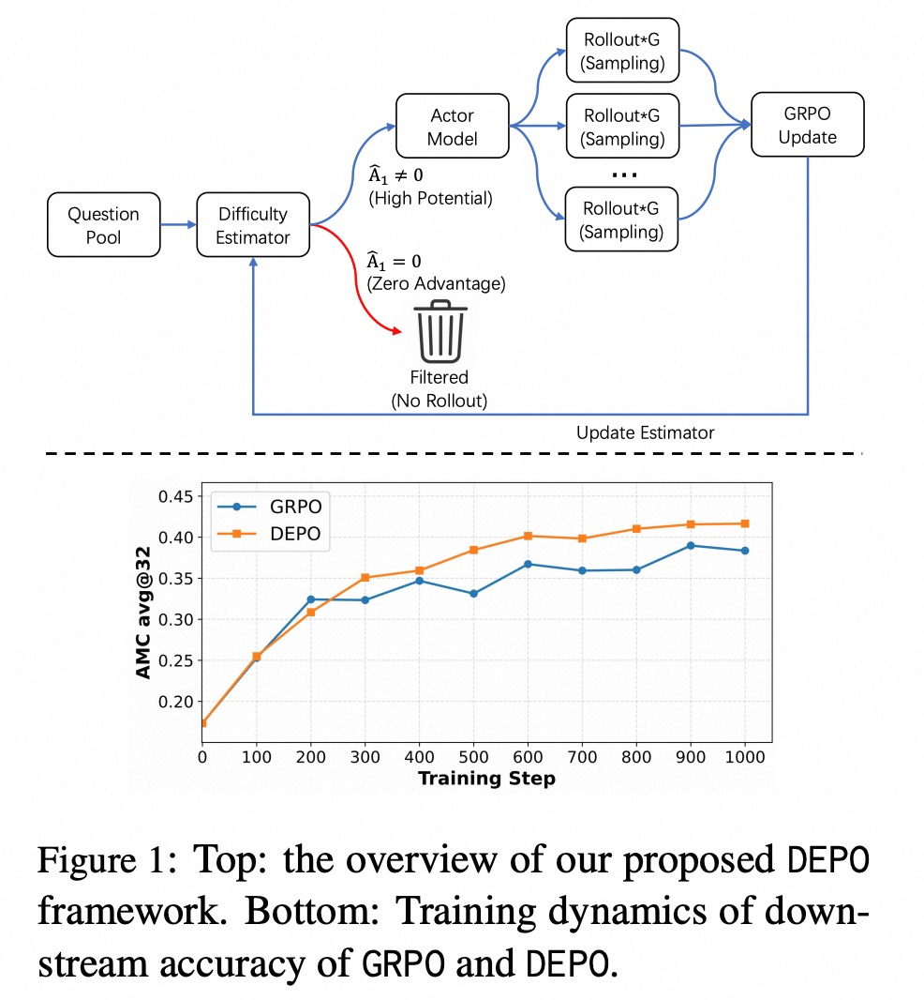
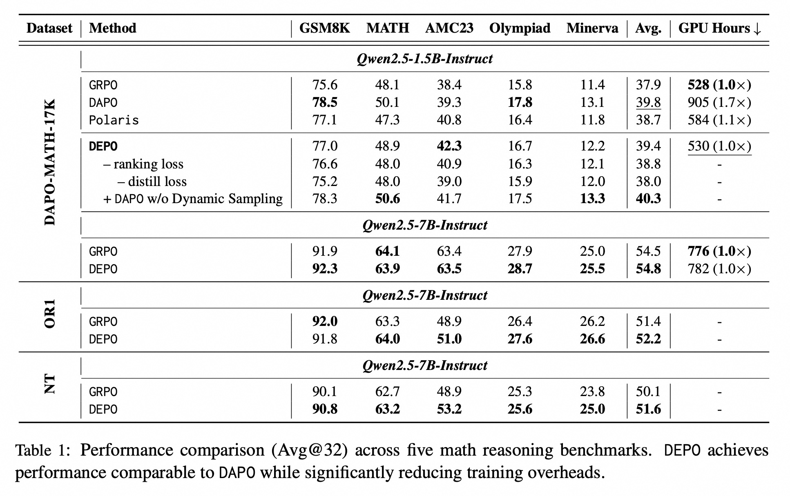
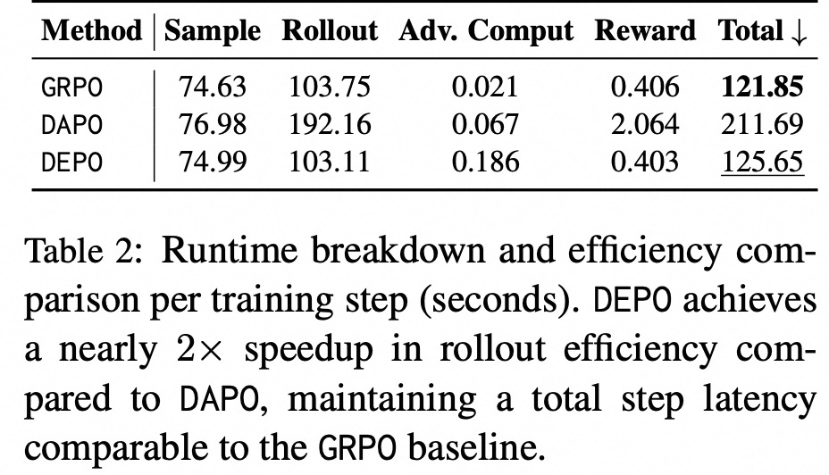

<p align="center">
    
<p>

# DEPO: Difficulty-Estimated Policy Optimization

<!-- Broader Real-World Applications -->

<!-- # A State-Transition Framework for Efficient LLM Reasoning -->

<!-- <h2 align="center"> <a href="https://github.com/AIDC-AI/Marco-o1/">Marco-o1</a></h2> -->
<!-- <h5 align="center"> If you appreciate our project, please consider giving us a star ⭐ on GitHub to stay updated with the latest developments.  </h2> -->
 
<h4 align="center">

<!-- [](https://huggingface.co/) [](https://github.com/AIDC-AI/Marco-o1/) -->


<div align="center">
 


</h4>

<div align="center">

<!-- **Affiliations:** -->

⭐ _**MarcoPolo Team**_ ⭐

[_**Alibaba International Digital Commerce**_](https://aidc-ai.com)

:octocat: [**Github**](https://github.com/AIDC-AI/Marco-o1)  🤗  [**Hugging Face**](https://huggingface.co/AIDC-AI/Marco-o1) 📝  [**Paper**](https://arxiv.org/abs/2503.01461) 🧑‍💻 [**Model**](https://huggingface.co/AIDC-AI/Marco-o1) 🗂️  [**Data**](https://github.com/AIDC-AI/Marco-o1/tree/main/data) 📽️  [**Demo**](https://huggingface.co/AIDC-AI/Marco-o1)

</div>


## 🔔 Introduction
Recent advancements in Large Reasoning
Models (LRMs), exemplified by DeepSeekR1, have underscored the potential of scaling inference-time compute through Group
Relative Policy Optimization (GRPO). However, GRPO frequently suffers from gradient
signal attenuation when encountering problems that are either too trivial or overly complex. In these scenarios, the disappearance
of inter-group advantages makes the gradient signal susceptible to noise, thereby jeopardizing convergence stability. While variants like DAPO attempt to rectify gradient
vanishing, they do not alleviate the substantial computational overhead incurred by exhaustive rollouts on low-utility samples. In
this paper, we propose **Difficulty-Estimated
Policy Optimization (DEPO)**, a novel framework designed to optimize the efficiency
and robustness of reasoning alignment.
DEPO integrates an online Difficulty Estimator that dynamically assesses and filters
training data before the rollout phase. This
mechanism ensures that computational resources are prioritized for samples with high
learning potential. 

Empirical results demonstrate that DEPO achieves up to a 2× reduction in rollout costs without compromising
model performance. Our approach significantly lowers the computational barrier for
training high-performance reasoning models, offering a more sustainable path for reasoning scaling.

To our knowledge, this is the first work on online data selection and it brings significant benefits to large-scale online services.

<div align="center">
  
</div>

## 💡 Training Data Construction


## 🚀 Overall Framework
<div align="center">
  
</div>

In our framework, we design a Mixed Attention Module (**MAM**) to replace the softmax attention module in LLMs, which consists of a Softmax Attention (**SA**) submodule and a Linear Attention (**LA**) submodule. 
To avoid the performance loss caused by this replacement, we use the original softmax attention module of LLMs as our **SA** submodule. However, in the **SA** submodule, each token can only attend to the tokens in the query prompt **Q** and the previously generated tokens in its reasoning step. 
By doing so, we reduce the computational complexity of attention from quadratic **O(C^2)** to linear **O(C)** and the memory usage of the KV‑cache from linear **O(C)** to constant **O(1)**, where **C** denotes the context length.
Moreover, the **LA** submodule applies a linear attention mechanism to obtain the LLM’s reasoning state matrix, which records the reasoning information from previously completed reasoning steps. 
Therefore, each token in the current reasoning step can access relevant historical information from the state matrix without attending directly to tokens in previous reasoning steps.


## 🍬 Reasoning Strategy \& Training Strategy
<div align="center">
  
</div>

During reasoning, LLMs often produce noisy reasoning steps that may mislead subsequent ones, thus resulting in overthinking problems.
In our framework, such noisy reasoning step can deviate the model’s state transitions from the correct reasoning trajectory, resulting in erroneous results (see Figure 3(a)).
To mitigate this issue, we propose a state‑based reasoning strategy, which guides model reasoning with a global reasoning direction.


To improve training efficiency while preserving the original reasoning ability of LLMs, we fine‑tune only the parameters of the newly added LA submodule.
As shown in Figure 3(b), we jointly optimize our model with two loss terms: (1) the autoregressive loss **L_AR** of our model on the training samples, and (2) the knowledge distillation loss **L_KD** between the base model and our proposed model.


## 🎯 Experimental Results

The experimental results on mathematical benchmarks are presented in Table 1. 
As shown in the *AVG.* column, our framework outperforms all baselines in reasoning efficiency and attains the best overall performance.

<div align="center">
  
</div>


We further conduct extensive ablation studies by removing different components from our framework to investigate their different impacts. 

<div align="center">
  
</div>


For more detail please refer to our [paper](https://arxiv.org/pdf/2602.06375).

## ⚡️ Released Resources

We use [Verl](https://github.com/volcengine/verl) to train our model. Code will be release in the near future.


## 👨🏻‍💻 Acknowledgement

## Main Contributors
From MarcoPolo Team, AI Business, Alibaba International Digital Commerce:
- [Yu Zhao](https://github.com/Sniper970119)
- Fan Jiang
- [Longyue Wang](http://www.longyuewang.com)

If you find DEPO useful for your research and applications, please cite:

```
@misc{zhao2026difficultyestimatedpolicyoptimization,
      title={Difficulty-Estimated Policy Optimization}, 
      author={Yu Zhao and Fan Jiang and Tianle Liu and Bo Zeng and Yu Liu and Longyue Wang and Weihua Luo},
      year={2026},
      eprint={2602.06375},
      archivePrefix={arXiv},
      primaryClass={cs.AI},
      url={https://arxiv.org/abs/2602.06375}, 
}
```