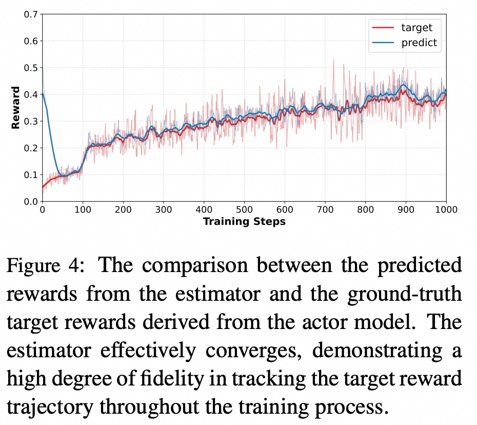
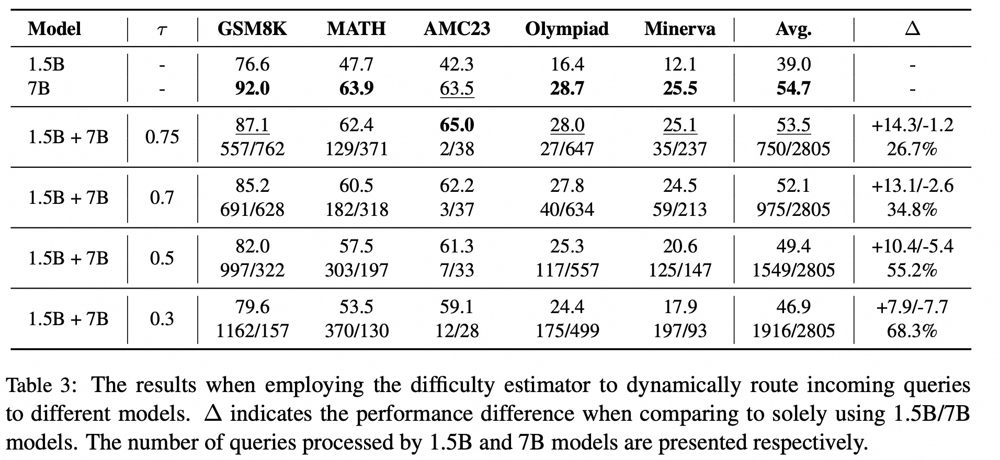

<p align="center">
    
<p>

# DEPO: Difficulty-Estimated Policy Optimization

<!-- Broader Real-World Applications -->

<!-- # A State-Transition Framework for Efficient LLM Reasoning -->

<!-- <h2 align="center"> <a href="https://github.com/AIDC-AI/Marco-o1/">Marco-o1</a></h2> -->
<!-- <h5 align="center"> If you appreciate our project, please consider giving us a star ⭐ on GitHub to stay updated with the latest developments.  </h2> -->
 
<h4 align="center">

<!-- [](https://huggingface.co/) [](https://github.com/AIDC-AI/Marco-o1/) -->


<div align="center">
 


</h4>

<div align="center">

<!-- **Affiliations:** -->

⭐ _**MarcoPolo Team**_ ⭐

[_**Alibaba International Digital Commerce**_](https://aidc-ai.com)

:octocat: [**Github**](https://github.com/AIDC-AI/Marco-o1)  🤗  [**Hugging Face**](https://huggingface.co/AIDC-AI/Marco-o1) 📝  [**Paper**](https://arxiv.org/abs/2503.01461) 🧑‍💻 [**Model**](https://huggingface.co/AIDC-AI/Marco-o1) 🗂️  [**Data**](https://github.com/AIDC-AI/Marco-o1/tree/main/data) 📽️  [**Demo**](https://huggingface.co/AIDC-AI/Marco-o1)

</div>


## 🔔 Introduction
Recent advancements in Large Reasoning
Models (LRMs), exemplified by DeepSeekR1, have underscored the potential of scaling inference-time compute through Group
Relative Policy Optimization (GRPO). However, GRPO frequently suffers from gradient
signal attenuation when encountering problems that are either too trivial or overly complex. In these scenarios, the disappearance
of inter-group advantages makes the gradient signal susceptible to noise, thereby jeopardizing convergence stability. While variants like DAPO attempt to rectify gradient
vanishing, they do not alleviate the substantial computational overhead incurred by exhaustive rollouts on low-utility samples. In
this paper, we propose **Difficulty-Estimated
Policy Optimization (DEPO)**, a novel framework designed to optimize the efficiency
and robustness of reasoning alignment.
DEPO integrates an online Difficulty Estimator that dynamically assesses and filters
training data before the rollout phase. This
mechanism ensures that computational resources are prioritized for samples with high
learning potential. 

Empirical results demonstrate that DEPO achieves up to a 2× reduction in rollout costs without compromising
model performance. Our approach significantly lowers the computational barrier for
training high-performance reasoning models, offering a more sustainable path for reasoning scaling.

To our knowledge, this is the first work on online data selection and it brings significant benefits to large-scale online services.

<div align="center">
  
</div>

## 💡  Overall Framework 
The main problem of GRPOs reinforcement learning is that the zero Advantage samples not only waste compute resources(rollout) 
but also cause negative interference to the gradient. This work introduces a bert to predict the difficulty of the samples, 
and performs a low-cost filtering in advance.

The filtered samples are returned to the standard training process of GRPO and the average reward result calculated by rollout in the standard training process is used to update the prediction of the bert. 
The filtered samples will not theoretically generate zero Advantage, thus having a more stable gradient direction and lower computational cost. It is worth noting that this work is an orthogonal framework to other algorithm optimizations (such as DAPO).

The experiment shows that our difficulty estimation model can well fit the actual difficulty distribution. It has effectively filtered out the zero Advantage data.

<div align="center">
  
</div>


## 🎯 Experimental Results

The experimental results on mathematical benchmarks are presented in Table 1. 

Compared to the standard GRPO, we achieved an average improvement of 1.5% under similar computing resources, 
which is close to the performance of DAPO, but the computing cost of DAPO exceeds ours by 70%. 
Compared to the offline filtering Polaris solution, we still gained certain performance and computing cost advantages. 

Since we mentioned in the previous question that our algorithm and other improvements (such as DAPO) are orthogonal, 
we also verified DEPO + DAPO (without Dynamic Sampling), and achieved the highest performance improvement of 2.4%.

<div align="center">
  
</div>

We also conducted further experiments, including the impact of different data difficulty/models size on the algorithm. 
When the training data was of "moderate difficulty" for the model, most of the data was not filtered out (for example, 7B vs DAPO-MATH-17K), 
and the performance improvement was very slight.
However, when using simpler (OR1) and more difficult (NT) datasets, our algorithm began to take effect and achieved 
significant performance improvement. This is also in line with our intuitive understanding with the framework.


Meanwhile, we also compared the computing time for each step. It can be observed that the three algorithms spent almost 
the same amount of time on a single sample sampling. However, when looking at the overall rollout time and total time, 
DEPO has a significant advantage over DAPO.

<div align="center">
  
</div>


## 🚀 Online data selection

Since our difficulty estimator is trained in real-time in conjunction with the actor model, we also made an interesting experiment.

In the online service, 80% of the data only covers 20% of the scenarios, and a large number of problems are homogeneous and simple. 
This pre-estimator can be used for online request routing. We designed an experimental method, using the difficulty pre-estimator 
of the 1.5B model to predict the data difficulty. If it is below a certain threshold, we consider that the 1.5B model is not 
confident in solving this problem, and route it to the 7B model for resolution. The experimental results are as follows:


<div align="center">
  
</div>

When the threshold was set at 0.75, 26.7% of the requests were routed to the 1.5B model for processing, 
and the final result was not significantly lower compared to the 7B model. This demonstrates the potential of our framework 
in large-scale online services.


For more detail please refer to our [paper](https://arxiv.org/pdf/2602.06375).

## ⚡️ Released Resources

We use [Verl](https://github.com/volcengine/verl) to train our model. Code will be release in the near future.


## 👨🏻‍💻 Acknowledgement

## Main Contributors
From MarcoPolo Team, AI Business, Alibaba International Digital Commerce:
- [Yu Zhao](https://github.com/Sniper970119)
- Fan Jiang
- [Longyue Wang](http://www.longyuewang.com)

If you find DEPO useful for your research and applications, please cite:

```
@misc{zhao2026difficultyestimatedpolicyoptimization,
      title={Difficulty-Estimated Policy Optimization}, 
      author={Yu Zhao and Fan Jiang and Tianle Liu and Bo Zeng and Yu Liu and Longyue Wang and Weihua Luo},
      year={2026},
      eprint={2602.06375},
      archivePrefix={arXiv},
      primaryClass={cs.AI},
      url={https://arxiv.org/abs/2602.06375}, 
}
```