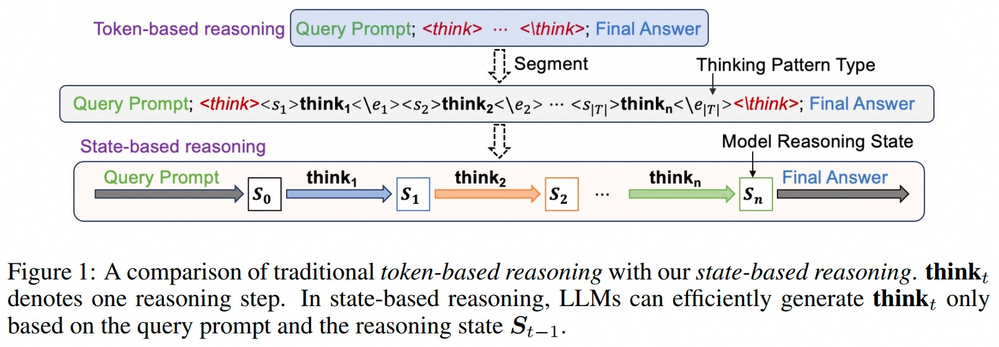
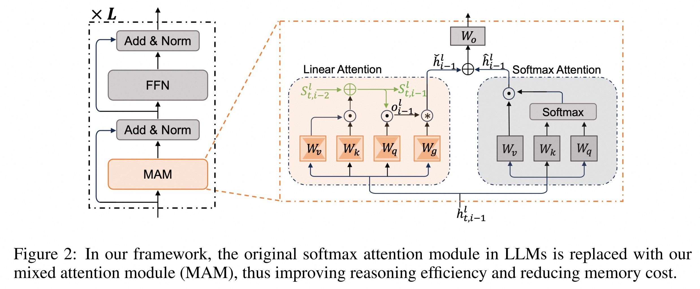
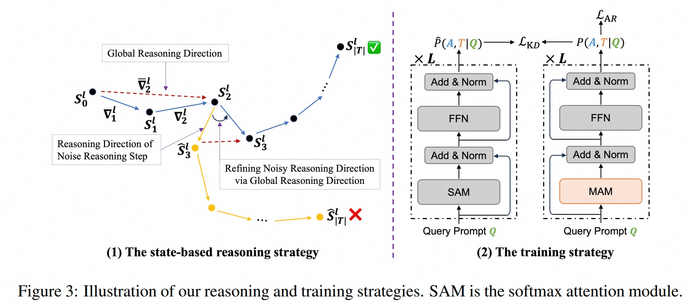
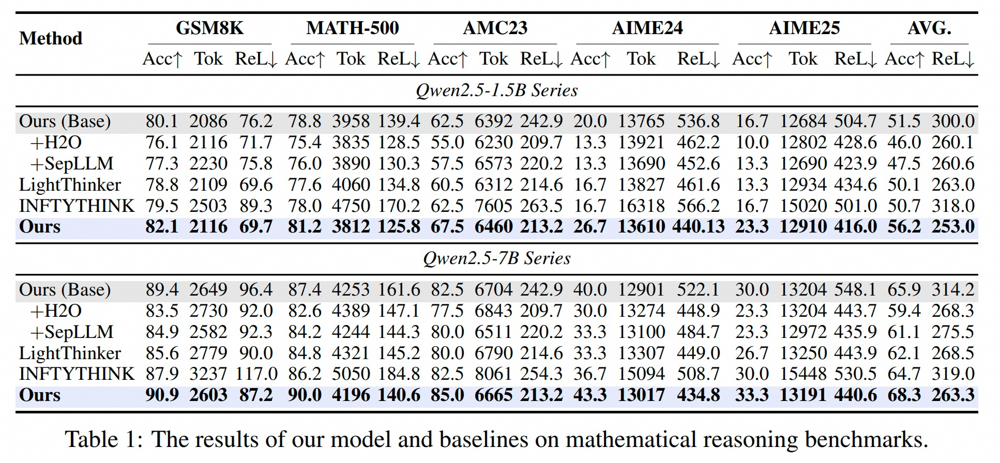
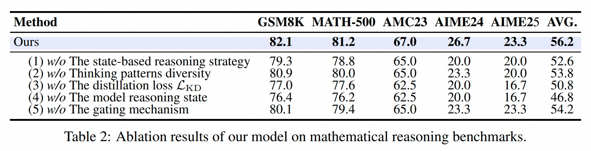

    

# A State-Transition Framework for Efficient LLM Reasoning

<!-- Broader Real-World Applications -->

<!-- # A State-Transition Framework for Efficient LLM Reasoning -->

<!-- <h2 align="center"> <a href="https://github.com/AIDC-AI/Marco-o1/">Marco-o1</a></h2> -->
<!-- <h5 align="center"> If you appreciate our project, please consider giving us a star ⭐ on GitHub to stay updated with the latest developments.  </h2> -->
 
<h4 align="center">

<!--   -->

 

</h4>

<!-- **Affiliations:** -->

⭐ _**MarcoPolo Team**_ ⭐

[_**Alibaba International Digital Commerce**_](https://aidc-ai.com)

:octocat: [**Github**](https://github.com/AIDC-AI/Marco-o1)  🤗  [**Hugging Face**](https://huggingface.co/AIDC-AI/Marco-o1) 📝  [**Paper**](https://arxiv.org/abs/2503.01461) 🧑‍💻 [**Model**](https://huggingface.co/AIDC-AI/Marco-o1) 🗂️  [**Data**](https://github.com/AIDC-AI/Marco-o1/tree/main/data) 📽️  [**Demo**](https://huggingface.co/AIDC-AI/Marco-o1)

## 🔔 Introduction
While Long Chain-of-Thought (CoT) reasoning significantly improves Large Language Models (LLMs) performance on complex reasoning tasks, the substantial computational and memory costs of generating long CoT sequences limit their efficiency and practicality.
To address this issue, we introduce a State-Transition Framework for Efficient LLM Reasoning that accelerates test-time reasoning while preserving model accuracy.
In this framework, we use a Linear Attention Mechanism to model the reasoning process of LLMs as a state-transition process. 
Rather than shortening or rewriting the CoT, we compress the historical reasoning signals from completed steps into a lightweight “reasoning state”.
Therefore, each token in the current reasoning step can directly retrieve relevant historical reasoning information from the reasoning state, without explicitly attending to tokens in previous reasoning steps.
In this way, the computational complexity of attention is reduced from quadratic to linear, significantly improving the reasoning efficiency of LLMs.
In addition, we propose a state-based reasoning strategy to mitigate the over-thinking issue caused by noisy reasoning steps. 

Our paper has been published in the main track of ICLR 2026, and we have open-sourced the related code.

## 💡 Training Data Construction

  

A long CoT sample (**Q**, **T**, **A**) usually comprises three parts: a query prompt **Q**, a thinking sequence **T**, and a final answer **A**.
Given the query prompt **Q**, LLMs first perform complex reasoning (**T**), and then generates the final answer **A**.
During reasoning, LLMs engage in various thinking patterns (*e.g.*, *reflection* and *result verification*) and switch between them using common transitional tokens (*e.g.*, “*Wait*”, “*Hmm*”).
Here, we refer to the completion of a thinking pattern by LLMs as a *reasoning step*.

We first extract high‑entropy transition tokens from the long CoT training set, which occur at the start of a sentence. Next, we use these tokens to segment the thinking sequence **T** in each training sample into a sequence of reasoning steps. Meanwhile, we cluster all reasoning steps in the entire training set, with each cluster corresponding to a thinking pattern (*i.e.*, type). Finally, for each thinking pattern, we introduce two special tokens to enclose its corresponding reasoning steps, as shown in Figure 1.

With the reconstructed training set, the trained LLMs can generate more structured thinking sequences.
Meanwhile, these special tokens allow us to track and control the reasoning processes of LLMs more accurately.

## 🚀 Overall Framework

  

In our framework, we design a Mixed Attention Module (**MAM**) to replace the softmax attention module in LLMs, which consists of a Softmax Attention (**SA**) submodule and a Linear Attention (**LA**) submodule. 
To avoid the performance loss caused by this replacement, we use the original softmax attention module of LLMs as our **SA** submodule. However, in the **SA** submodule, each token can only attend to the tokens in the query prompt **Q** and the previously generated tokens in its reasoning step. 
By doing so, we reduce the computational complexity of attention from quadratic **O(C^2)** to linear **O(C)** and the memory usage of the KV‑cache from linear **O(C)** to constant **O(1)**, where **C** denotes the context length.
Moreover, the **LA** submodule applies a linear attention mechanism to obtain the LLM’s reasoning state matrix, which records the reasoning information from previously completed reasoning steps. 
Therefore, each token in the current reasoning step can access relevant historical information from the state matrix without attending directly to tokens in previous reasoning steps.

## 🍬 Reasoning Strategy \& Training Strategy

  

During reasoning, LLMs often produce noisy reasoning steps that may mislead subsequent ones, thus resulting in overthinking problems.
In our framework, such noisy reasoning step can deviate the model’s state transitions from the correct reasoning trajectory, resulting in erroneous results (see Figure 3(a)).
To mitigate this issue, we propose a state‑based reasoning strategy, which guides model reasoning with a global reasoning direction.

To improve training efficiency while preserving the original reasoning ability of LLMs, we fine‑tune only the parameters of the newly added LA submodule.
As shown in Figure 3(b), we jointly optimize our model with two loss terms: (1) the autoregressive loss **L_AR** of our model on the training samples, and (2) the knowledge distillation loss **L_KD** between the base model and our proposed model.

## 🎯 Experimental Results

The experimental results on mathematical benchmarks are presented in Table 1. 
As shown in the *AVG.* column, our framework outperforms all baselines in reasoning efficiency and attains the best overall performance.

  

We further conduct extensive ablation studies by removing different components from our framework to investigate their different impacts. 

  

For more detail please refer to our [paper](https://arxiv.org/abs/2602.01198).

## ⚡️ Released Resources

We use [Open-R1](https://github.com/huggingface/open-r1) to train our model. Code will be release in the near future.

## 👨🏻‍💻 Acknowledgement

## Main Contributors
From Xiamen University:
- [Liang Zhang](https://scholar.google.com/citations?user=MSCCJiMAAAAJ&hl=zh-CN)

From MarcoPolo Team, AI Business, Alibaba International Digital Commerce:
- [Yu Zhao](https://github.com/Sniper970119)
- [Longyue Wang](http://www.longyuewang.com)

